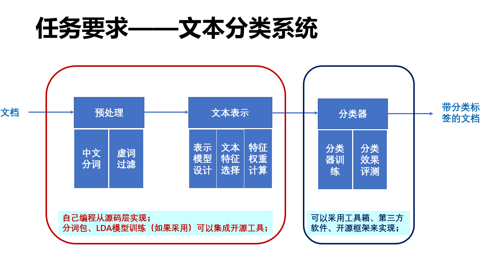
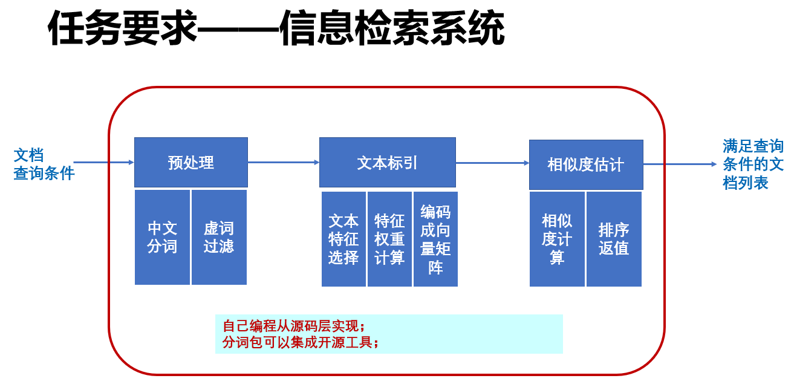

# NLP任务1

## 数据集说明

- 文本内容以GB18030编码存储，部分数字、字母为全角字符
- 数据集主要为体育方面新闻，以比赛项目进行分类，将数据集划为26类，每类存放100-300不等文件

```
分类为：
棒球,帆船帆板,重剑,举重,篮球,垒球,马术,排球,皮划艇,乒乓球,曲棍球,搏击,柔道,赛艇,射击,射箭,手球,摔跤,跆拳道,体操,田径,网球,游泳,羽毛球,自行车,足球
```

## 任务概述






## Todos

- [ ] 屏蔽内容推荐   e.g. 3（0).txt

## 0. 数据预处理

此部分为两任务公共部分，操作均为中文分词与虚词过滤

## 1.1 文本分类任务

## 1.2 
